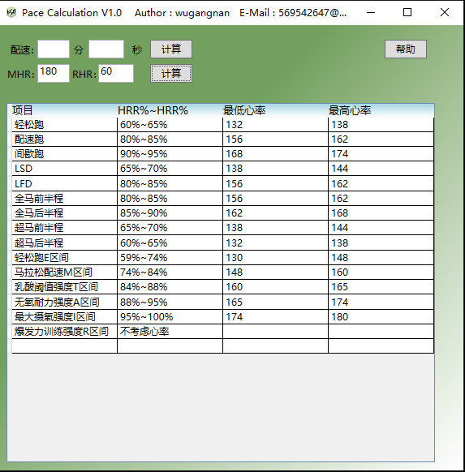
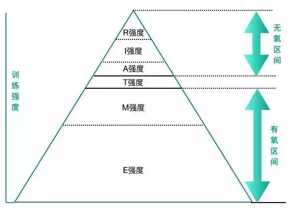
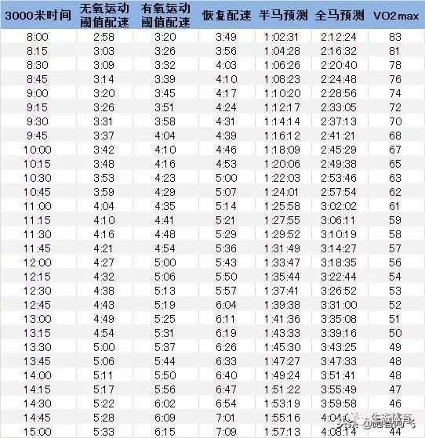

# Pace_Calculation_V1.0
## 1.界面

---

## 2.参考
* [马拉松训练指南：跑步数据解密心率篇](https://zhuanlan.zhihu.com/p/51501684)
* [【知识】学会计算储备心率HRR，有的放矢去跑步 ](https://www.sohu.com/a/210408415_100048225)

## 3.使用说明
为方便跑友计算不同配速下5KM/10KM/半马/全马所用时间，开发了此工具。

* 1.你只需输入你想要计算的配速x分x秒，即可计算出全马所有公里数累计用时。

* 2.增加各种跑步模式推荐心率（储备心率法）。

## 4.储备心率法说明

储备心率法（Heart Rate Reserve，简称HRR）由Karvonen等人于1957年首先提出，是目前马拉松训练比较推崇的科学训练方法。

* MHR：最大心率(心跳次数/每分钟)(Maximum Heart Rate),每分钟最大心跳次数，全力运动至疲惫时可达到。懒人公式: 220-年龄
* RHR：静止心跳,在清醒、不活动的安静状态下，每分钟心跳的次数。(Resting Heart Rate)
* HRR：储备心率法（Heart Rate Reserve，简称HRR）=（MHR最大心率-RHR静息心率）×强度百分比+RHR静息心率

按照HRR方法确定目标强度心率，可把运动强度划分为E/M/T/I/R共计5种强度（%HRR）

区间 |储备心率% |训练目的 |
| --- | --- | --- |
|E  | 59 % ~74 %   |增强有氧能力培养基础体能 |
|M   | 74 % ~84 %  |  模拟比赛强度习惯长距离比赛配速 |
|T   | 84 % ~88 %   | 刺激乳酸阈值强化排酸能力 |
|A    |88 % ~95 %   | 提升无氧能力训练耐乳酸能力 |
|I    |95 % ~100 %  | 刺激最大摄氧量加强有氧容量 |
|R    |不考虑心率    |加强运动经济性、无氧能力 |

可以看到，E和M都是有氧训练。按照这5种心率区间进行训练的方法，叫做储备心率区间法。

### E强度轻松跑区间

* 避免运动伤害

* 增加心脏收缩肌肉的力量

* 增加肌肉的用氧效率

* E强度区间下的长距离慢跑是提升线粒体数量的最佳训练方式

### M强度马拉松配速

* 可以模拟比赛强度

* 提升并掌握配速的能力

* 训练马拉松比赛时的补给技巧

* 同时也是进行LSD训练时的强度选择

### T强度乳酸阈值区间

* 让身体在更苛刻的配速下维持更久的时间

* 训练并提升自身乳酸阈值的能力

* 节奏跑Tempo Run可以选择此强度区间

### A强度无氧耐力区间

* 高于自身乳酸阈值的强度

* 可以作为5K或10K的竞赛配速

* 还有助于提升有氧代谢的能力

* 整体提高有氧水平

### I强度最大摄氧区间

* 此区间属于极限训练区间

* 可以逼迫出最大摄氧量

* 通常作为间歇训练的强度区间

* 例如著名的亚索800间歇

当清晰准确地计算出自己的跑步区间之后，我们就可以有的放矢地进行跑步训练了，这样才可以最大限度地达到运动效果，否则只会事倍功半，也会大幅度增加受伤的几率，健康跑步从科学的训练计划开始。

## 5.最大摄氧量（VO2MAX）

* [马拉松圣经 | 最大摄氧量](https://www.aisoutu.com/a/1083839)

一名运动者在一次吸气中所能吸入的最大氧气量被称为最大摄氧量。对跑步者而言，最大摄氧量是决定其耐力至关重要的因素。知道了一名跑步者的最大摄氧量，就能提前预测其跑步用时。血液中含有的氧气越多，以有氧形式生成的能量就越多，这意味着跑步者拥有了更强的力量耐力和更低的血乳酸浓度。总的来说，氧气吸入量的增加会使心率下降。

最大摄氧量的单位为毫升/千克/分钟（即1分钟内每千克体重吸入多少毫升氧气）。只有进行成绩诊断才能测出最大摄氧量的精确值。可以一边增加负荷，一边通过面罩测量并记录下氧气吸入量。顶级运动员的最大摄氧量可以达到75～90毫升/千克/分钟，受过良好训练的运动员的最大摄氧量为50～70毫升/千克/分钟，未经训练的跑步者的最大摄氧量只有30～40毫升/千克/分钟。

因此，每个健康的人都可以在4小时左右跑完一场马拉松。女子的最大摄氧量比男子的约低10%，所以男子和女子的马拉松成绩有20分钟左右的差距。随着年龄的增长，人体吸入氧气的能力逐渐减弱。从30岁开始，最大摄氧量每年降低约1%；从50岁开始，每年降低约0.5%。这也是比赛成绩会随运动员年龄增长而下降的原因之一。随着最大摄氧量的增加，人体的运动机能可以得到显著改善。最大摄氧量每增加1%，10千米跑的成绩能提高15～25秒，半程马拉松的成绩能提高约1分钟，而马拉松的成绩能提高2分钟左右。

吸烟会堵塞肺泡，氧气就无法被百分之百地吸收，这会减小最大摄氧量。当摄氧量达到最大时，机体的耐力表现也会达到最佳水平。

体重也会影响最大摄氧量。每减轻1千克体重，最大摄氧量就能提高1%。

通过增加每周力量耐力训练范围内的跑程以及阈值跑训练和无氧间歇跑训练（如1-2-3-2-1千米法特莱克跑、10×400米跑和10×1千米跑、12千米马拉松配速跑）可以增加最大摄氧量。进行400米间歇跑比进行耐久跑（基础耐力训练范围内）更有利于增加最大摄氧量。

呼吸技巧对吸氧量有很大影响。大多数跑步者的肺活量只达到了最大肺活量的70%～80%。因此，跑步者有必要针对呼吸技巧进行有意识的训练，以便在吸气时使肺部完全充满。这样一来，体内产生的乳酸就会减少，比赛成绩就会提高。长跑比赛中的比赛能力主要由摄氧量决定。

呼吸技巧在运动过程中，即便承受较大负荷，也要尽量深呼吸。

## 6.马拉松成绩预测

* [预测马拉松成绩的13种方法 ](https://www.sohu.com/a/289528782_505583)

如下是跑3000米来预测全马成绩图表：

结合上图来找自己适用的区间范围吧。